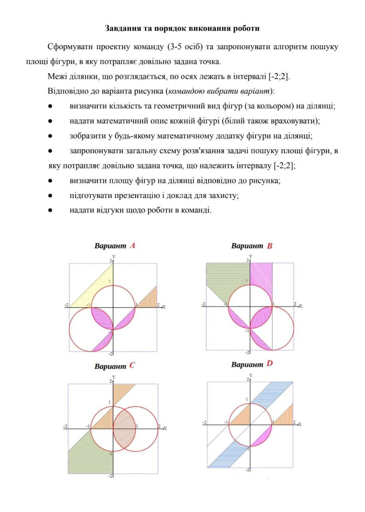
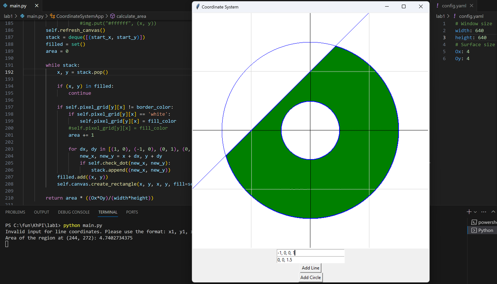

## Lab №1

The first team project. In this project we had to create a program, which can calculate area of different objects made by intersection of circles and lines

Assignment in ukranian:


Example of work:


You can add lines and circles by entering their coordinates and radius (if it is a circle). by clicking on some formed area its a
area will be displayed in the terminal.

## Installation

1. Clone the repository:
    ```bash
    git clone https://github.com/yourusername/ELf-linker.git
    cd ELf-linker
    ```
2. Install the requird packages using pip:

   ```bash
   pip install -r requirements.txt
   ```

## Usage
```bash
python main.py
```

In `config.yaml` you can change parameters of window size and surface size

## License

This project is licensed under the MIT License.